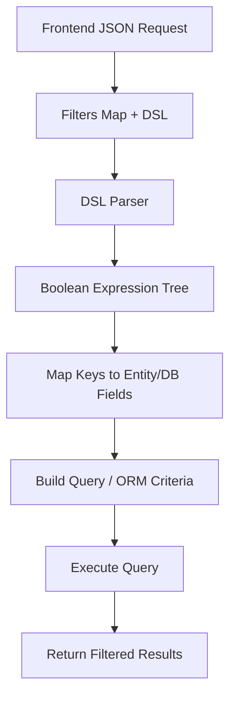

# Dynamic Filter Builder – Framework-Agnostic Solution
[](LICENSE)

**Dynamic Filter Builder** provides a portable, secure, and flexible way to handle complex filtering in backend APIs, regardless of the technology stack. It enables clients to send filter expressions using a clean domain-specific language (DSL), while the backend enforces type safety and prevents leaks of sensitive fields—all without locking into any single framework.

---

## Table of Contents
- [Motivation](#motivation)
- [Features](#features)
- [How It Works](#how-it-works)
- [JSON API Example](#json-api-example)
- [DSL Syntax](#dsl-syntax)
- [Implementation Overview](#implementation-overview)
- [Dynamic Filter Flow](#dynamic-filter-flow)
- [Portability](#portability)
- [Advantages](#advantages)
- [Future Enhancements](#future-enhancements)
- [License](#license)

---

## Motivation

Modern web applications often need **dynamic, user-driven search and filtering**. Traditional approaches—like hard-coded filters or exposing full SQL—are inflexible and can introduce security risks. This project offers a reusable solution that:
- Lets clients combine filters dynamically (AND, OR, NOT).
- Prevents direct access to sensitive database fields.
- Works with any backend stack by abstracting filter logic and field mapping.

---

## Features

- Simple, expressive *DSL-based* filter expressions:  
  For example, `(NAME & AGE) | CITY`.
- Secure *enum or key-based mapping*—only whitelisted fields are filterable.
- Backend-agnostic: Framework-independent core logic.
- Fully reusable across multiple entities and data models.
- Compatible with a variety of ORMs and database backends.

---

## How It Works

1. **Frontend** sends a JSON request containing:
    - `filters`: a map of keys to filter conditions (operator + value).
    - `combineWith`: a DSL string referencing those keys.
2. **Backend** workflow:
    - Maps allowed keys to real entity or database fields (via an enum/whitelist).
    - Parses the DSL to build a boolean expression tree.
    - Dynamically generates native query/filter objects.
    - Only exposes fields pre-approved for filtering.

---

## JSON API Example

**Request:**

```json
{
"filters": {
"NAME": { "operator": "LIKE", "value": "Smith" },
"STATUS": { "operator": "=", "value": "ACTIVE" },
"CREATED_DATE":{ "operator": ">=", "value": "2024-01-01" }
},
"combineWith": "(NAME & STATUS) | CREATED_DATE"
}
```

- `NAME`, `STATUS`, `CREATED_DATE` are **tokens** known to the backend (often defined as enum keys).
- Clients **cannot** query or even see actual database field names.
- `combineWith` is a tiny DSL referencing the filter keys.

**Interpreted as:**

```text
(NAME LIKE 'Smith' AND STATUS = 'ACTIVE') OR CREATED_DATE >= '2024-01-01'
```


---

## DSL Syntax

- **Operators:** `&` (AND), `|` (OR), `!` (NOT)
- Supports parentheses for grouping.
- Identifiers correspond to keys from the filter map.

**Example:**

```text
(NAME & STATUS) | !CREATED_DATE
```

- Filters on `NAME` and `STATUS` must both match, or the filter on `CREATED_DATE` must **not** match.

---

## Implementation Overview

- **Filter Map:** key → (operator, value)
- **DSL Expression:** string combining filter keys using `&`, `|`, `!`, and parentheses.
- **Field Mapping:** backend maps keys to allowed fields using an enum or whitelist.
- **Query Builder:** expression is transformed into native query/criteria objects based on the stack.

---

## Dynamic Filter Flow




**Explanation:**
1. **Request**: Client sends filters and a DSL expression.
2. **Parsing**: Backend parses the DSL into a logical tree.
3. **Mapping**: Each key is validated and mapped to a safe, allowed field.
4. **Building Query**: Expression tree is converted into backend-native queries or ORM filters.
5. **Execution**: Query runs, result set is returned.

---

## Portability

Dynamic Filter Builder is **framework-agnostic**:  
The filter expression parsing and key-to-field mappings are shared code, while only the final query builder is backend-specific.

| Language / Stack            | How to Apply Filters                                     | Notes                                                |
|-----------------------------|----------------------------------------------------------|------------------------------------------------------|
| **Java (Spring Boot)**      | Use JPA Specifications or `CriteriaBuilder`              | Enum maps keys → entity attributes                   |
| **.NET (C#/Entity Framework)** | LINQ expressions with `Expression<Func<T,bool>>`      | Natural mapping to strongly typed entities           |
| **Python (Django ORM)**     | Use `Q` objects for combining filters                    | DSL maps directly to `Q` composition                 |
| **Python (SQLAlchemy)**     | Build dynamic `filter()` conditions                      | Easy to plug DSL into query builder                  |
| **Node.js (Prisma)**        | Build `where` objects dynamically                        | DSL maps to nested JSON filters                      |
| **Node.js (TypeORM)**       | Query builder with chained `andWhere` / `orWhere`        | Enum ensures only safe fields are exposed            |
| **GraphQL**                 | Map DSL filters to resolver arguments → ORM queries      | Provides schema-safe filtering                       |
| **Other SQL backends**      | Translate DSL → raw `WHERE` clauses safely               | Enum whitelist prevents SQL injection                |

---

## Advantages

- **Security:** No exposure of internal schema; only whitelisted fields are filterable.
- **Flexibility:** Clients can combine arbitrary filters with DSL logic.
- **Portability:** Pluggable with Spring/JPA, Entity Framework, SQLAlchemy, Prisma, and more.
- **Maintainability:** Manage filterable fields centrally—update enum/whitelist, not query code.

---

## Future Enhancements

- Add support for more operators (`between`, `in`, `isNull`, etc.).
- Type-aware validation (date, numeric, boolean constraints).
- Query optimizer (e.g., merging overlapping filters).
- Integrated pagination and sorting.

---

## License

MIT License

