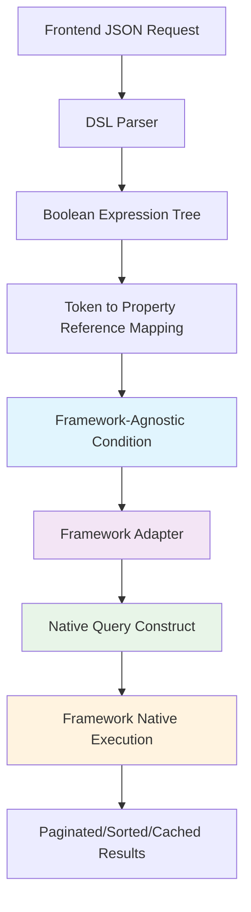

# Dynamic Filter Builder — Framework-Agnostic Condition Generator

[](LICENSE)

---

## Table of Contents
- [Motivation](#motivation)
- [Features](#features)
- [How It Works](#how-it-works)
- [JSON API Example](#json-api-example)
- [DSL Syntax](#dsl-syntax)
- [Implementation Overview](#implementation-overview)
- [Dynamic Filter Flow](#dynamic-filter-flow)
- [Framework Integration](#framework-integration)
- [Advantages](#advantages)
- [Future Enhancements](#future-enhancements)
- [License](#license)

---

## Motivation

Modern web applications often need **dynamic, user-driven search and filtering**. Traditional approaches like static filters or exposing raw queries are inflexible or expose security risks.

This library proposes a reusable, framework-agnostic solution that:
- Allows clients to build complex filter conditions dynamically combining multiple criteria with AND, OR, NOT.
- Prevents direct exposure of database fields by using abstract tokens.
- Supports multiple conditions on the same property by separating filter token from property reference.
- **Generates framework-native conditions** that integrate seamlessly with existing ORM/query mechanisms.

---

## Features

- Expressive, simple *DSL-based* filter language  
- Filter tokens uniquely identify conditions, with clear `ref` mapping to backend properties  
- Complex boolean logic with `AND`, `OR`, `NOT`, and parentheses  
- Secure enum or whitelist-based field mapping preventing access to sensitive data  
- **Framework-agnostic condition generation** - works with any ORM or query builder
- **Preserves native framework capabilities** - pagination, sorting, caching, transactions, etc.

---

## How It Works

1. The client sends a JSON request:
   - `filters`: an object mapping unique filter tokens (keys) to filter conditions, each condition including a `ref` field referencing the backend property.
   - `combineWith`: a DSL string referencing the tokens, expressing the boolean logic.

2. The backend:
   - Maps tokens to validated properties via `ref`.
   - Parses the DSL into a boolean expression tree.
   - **Generates a framework-agnostic condition object**.
   - **Converts the condition to native framework queries** (JPA Criteria, Prisma where, Django Q, etc.).
   - **Executes using framework's native mechanisms** for optimal performance and feature support.

---

## JSON API Example

**Request:**

```json
{
  "filters": {
    "filter1": { "ref": "NAME", "operator": "LIKE", "value": "Smith" },
    "filter2": { "ref": "STATUS", "operator": "=", "value": "ACTIVE" },
    "filter3": { "ref": "CREATED_DATE", "operator": ">=", "value": "2024-01-01" },
    "filter4": { "ref": "NAME", "operator": "NOT LIKE", "value": "John" }
  },
  "combineWith": "(filter1 & filter2) | (filter3 & !filter4)"
}
```

**Generated Condition Logic:**

```sql
(NAME LIKE 'Smith' AND STATUS = 'ACTIVE') OR (CREATED_DATE >= '2024-01-01' AND NOT(NAME LIKE 'John'))
```

---

## DSL Syntax

- Logical operators supported:  
  - `&` for AND  
  - `|` for OR  
  - `!` for NOT  
- Parentheses for grouping expressions.  
- Identifiers correspond to filter tokens in the `filters` object, not directly to properties.

**Example:**

```cpp
(filter1 & filter2) | !filter3
```

---

## Implementation Overview

- **Filter Map:** JSON object with unique tokens → filter conditions including `ref`, operator, and value.  
- **DSL Expression:** String combining filter tokens via `&`, `|`, `!`, and parentheses.  
- **Secure Mapping:** Tokens map to allowed properties defined in a backend whitelist or enum.  
- **Condition Generator:** The DSL parser generates a boolean expression tree, which produces framework-agnostic conditions.
- **Framework Adapters:** Convert conditions to native query constructs (JPA Criteria, Prisma JSON, Django Q, etc.).

---

## Dynamic Filter Flow



---

## Framework Integration

This library's core is **framework-agnostic** and focuses solely on **condition generation**:  
- Parsing and token-to-property mapping are shared and standalone.  
- Each framework adapter converts conditions to native constructs.
- **Query execution remains 100% framework-native** for optimal performance and feature support.

| Language / Stack              | Integration Approach                                      | Native Features Preserved                    |
|------------------------------|-----------------------------------------------------------|---------------------------------------------|
| Java/Spring Boot              | Convert to JPA `CriteriaQuery` predicates              | Pagination, JPA caching, lazy loading, transactions |
| .NET / Entity Framework       | Convert to LINQ expressions                             | Entity tracking, change detection, migrations |
| Python / Django ORM           | Convert to `Q` object composition                       | QuerySet chaining, prefetch_related, select_related |
| Node.js / Prisma              | Convert to nested JSON `where` clauses                 | Connection pooling, middleware, schema validation |
| Node.js / TypeORM             | Convert to query builder conditions                     | Migrations, decorators, relations |

---

## Advantages

- **Security:** Fields exposed only through controlled mappings.  
- **Flexibility:** Arbitrary complex filter conditions expressed via DSL.  
- **Framework neutrality:** Generate conditions for any backend stack.
- **Native performance:** Leverages each framework's optimized query execution.
- **Feature preservation:** Pagination, sorting, caching, transactions work normally.
- **Maintainability:** Centralized token-to-property mapping.  
- **Extensibility:** Add operators and DSL improvements independently.

---

## Future Enhancements

- Support additional operators (`IN`, `BETWEEN`, `IS NULL`, etc.).  
- Type-aware value validation (dates, enums, numbers).  
- Query optimization by merging overlapping conditions.
- Advanced DSL features (subqueries, aggregations).
- Visual query builder UI components.
- Performance monitoring and query analysis tools.

---

## License

MIT License

---