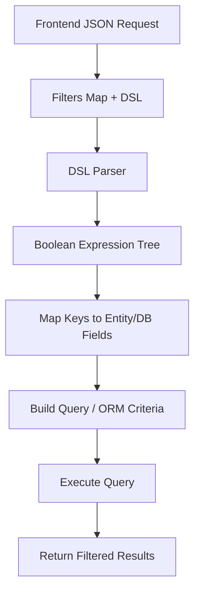

# Dynamic Filter Builder – Framework-Agnostic Approach

[](LICENSE)

This project demonstrates a *portable approach to dynamic filtering* for backend applications.   It allows clients to send *complex filter expressions* using a simple DSL while ensuring *type safety* and *security*, without being tied to a specific backend framework.

---

## Table of Contents

- [Motivation](#motivation)  
- [Features](#features)  
- [How It Works](#how-it-works)  
- [JSON API Example](#json-api-example)  
- [Implementation Overview](#implementation-overview)  
- [Dynamic Filter Flow](#dynamic-filter-flow)  
- [Portability](#portability)  
- [Advantages](#advantages)  
- [Future Improvements](#future-improvements)  

---

## Motivation

Dynamic filtering is a common requirement in modern web applications. Traditional approaches have limitations:

- Hard-coded filters on the backend.  
- Limited support for combining multiple conditions (AND, OR, NOT).  
- Security risk if clients can filter on sensitive or internal fields.  

This project solves these problems with a *generic, secure, and framework-agnostic filter builder*.

---

## Features

- Dynamic, *DSL-based filter expressions*: (NAME & AGE) | CITY.  
- *Enum or key-based field mapping* to ensure only allowed fields are filterable.  
- Secure: prevents exposing internal or sensitive fields.  
- Fully compatible with *any backend framework*.  
- Reusable across different entities or database models.  

---

## How It Works

1. *Frontend* sends a request containing:  
   - **filters** as a *map* of key → operator + value.  
   - **combineWith** as a *DSL* string using the keys.  

2. *Backend*:  
   - Maps keys to entity/database fields via an *enum or whitelist*.  
   - Parses the DSL into a boolean expression tree (AND, OR, NOT).  
   - Generates backend-native query objects dynamically.

---

## JSON API Example

*Request*:

```json
{
  "filters": {
    "NAME": { "operator": "LIKE", "value": "Smith" },
    "AGE": { "operator": ">", "value": 30 },
    "CITY": { "operator": "=", "value": "Paris" }
  },
  "combineWith": "(NAME & AGE) | CITY"
}
```

### Interpretation:

```sql
(NAME LIKE 'Smith' AND AGE > 30) OR CITY = 'Paris'
```

---

## Implementation Overview

*Filters map*: key → operator + value. Keys correspond to allowed fields.

*DSL*: string combining keys with & (AND), | (OR), ! (NOT), and parentheses.

*Field mapping*: backend maps keys to actual entity/database fields.

*Query builder*: dynamically builds query objects or criteria based on the parsed expression.


---

### Dynamic Filter Flow



### Flow Explanation:

1. **Frontend JSON Request**: Client sends filters + DSL expression.


2. **Filters Map + DSL**: Backend receives the request.


3. **DSL Parser**: Parses the string into a boolean expression tree with operators AND (&), OR (|), NOT (!), and parentheses.


4. **Boolean Expression Tree**: Leaves correspond to filter keys.


5. **Map Keys to Entity/DB Fields**: Each key maps to a valid field (via enum or whitelist).


6. **Build Query / ORM Criteria**: Convert the expression tree into backend-native query objects.


7. **Execute Query**: Run the query against the database.


8. **Return Filtered Results**: Send the filtered dataset back to the client.

---

## Portability

This approach is *framework-agnostic*:

- *Java / Spring Boot* → JPA Specifications or CriteriaBuilder.  
- *.NET* → LINQ queries with Entity Framework.  
- *Python* → SQLAlchemy filters or Django ORM Q objects.  
- *Node.js* → Prisma, TypeORM, or raw query builders.  
- *GraphQL* → Map filters directly into resolver arguments.  

Because filters are expressed in a *DSL + enum mapping*, the only backend-specific logic is the *final query builder*. Everything else (DSL parsing, enum safety, structure) can be reused across platforms.

---

## Advantages

-   **Security**: Clients cannot exploit internal DB schema.
-   **Flexibility**: Any combination of filters with DSL.
-   **Portability**: Works with JPA, SQLAlchemy, Entity Framework,
    Prisma, etc.
-   **Maintainability**: Adding/removing filterable fields is as simple
    as updating the enum.

---

## Future Enhancements

-   Support more operators (`between`, `in`, `isNull`, etc.).\
-   Type-aware validation (dates, numbers, booleans).\
-   Query optimization (merge redundant filters).\
-   Integration with pagination + sorting.

---

License

MIT License
