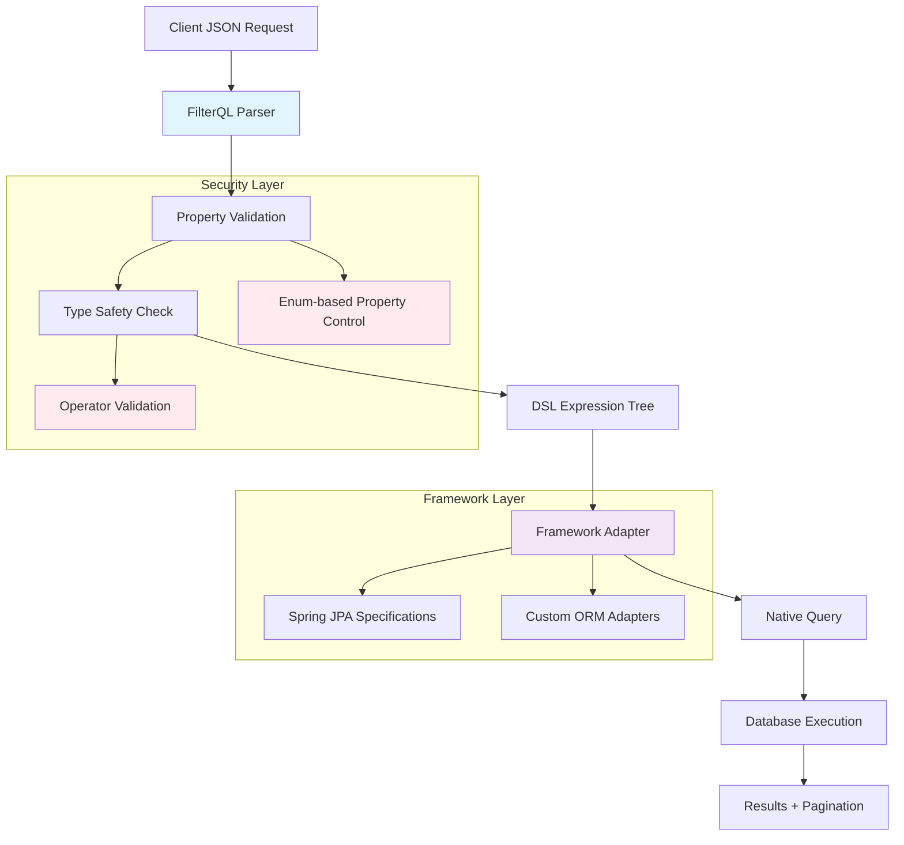

# FilterQL — Dynamic Filter Builder

[](https://central.sonatype.com/namespace/io.github.cyfko)
[](https://opensource.org/licenses/MIT)
[](https://openjdk.java.net/)

## What is FilterQL?

FilterQL is a framework-agnostic Java library that transforms complex, dynamic filtering requirements into simple, secure, and maintainable solutions. It provides a Domain-Specific Language (DSL) for building complex filter conditions while maintaining type safety and preventing SQL injection.

## Why Use FilterQL?

- 🔒 **Security First**: Abstract property references prevent direct database field exposure
- ⚡ **Dynamic Composition**: Build complex filter conditions with AND, OR, NOT operations
- 🎯 **Type Safety**: Compile-time validation with enum-based property definitions
- 🔧 **Framework Integration**: Native Spring Data JPA support with extensible adapter pattern
- 📊 **Performance Optimized**: Generates efficient native queries preserving ORM features

## 🎯 The Problem

Modern web applications often need **dynamic, user-driven search and filtering**. Traditional approaches have significant limitations:

**❌ Static Filters**: Hard-coded conditions that can't adapt to user needs
```java
// Inflexible - what if users want OR logic instead of AND?
public List<User> findUsers(String name, UserStatus status, Integer minAge) {
    return repository.findByNameAndStatusAndAgeGreaterThan(name, status, minAge);
}
```

**❌ Raw Query Exposure**: Security risks and tight coupling
```java
// Dangerous - exposes database structure and SQL injection risks
public List<User> search(String whereClause) {
    return entityManager.createQuery("SELECT u FROM User u WHERE " + whereClause).getResultList();
}
```

**❌ Parameter Explosion**: Unmanageable method signatures
```java
// Unmaintainable - method grows with every new filter
public Page<User> findUsers(String name, String email, Integer minAge, Integer maxAge, 
                           UserStatus status, List<String> roles, LocalDateTime createdAfter, 
                           Boolean isActive, String department, String sortBy, String sortDirection) {
    // Complex conditional logic...
}
```

## 💡 The FilterQL Solution

**FilterQL** provides a reusable, framework-agnostic solution that eliminates these problems:

✅ **Dynamic Composition** - Clients build complex filter conditions combining multiple criteria with AND, OR, NOT  
✅ **Security First** - Abstract property references prevent direct database field exposure  
✅ **Type Safety** - Compile-time validation with enum-based property definitions  
✅ **Framework Integration** - Generates native queries that preserve all ORM features  
✅ **Extensible** - Support for custom business logic and complex mappings

### From This (Traditional):
```java
// Rigid, unsafe, unmaintainable
userService.findUsers("John", null, 18, null, UserStatus.ACTIVE, null, null, true, "IT", "name", "asc");
```

### To This (FilterQL):
```json
{
  "filters": {
    "nameSearch": { "ref": "NAME", "operator": "MATCHES", "value": "John%" },
    "ageLimit": { "ref": "AGE", "operator": "GTE", "value": 18 },
    "activeStatus": { "ref": "STATUS", "operator": "EQ", "value": "ACTIVE" },
    "itDepartment": { "ref": "DEPARTMENT", "operator": "EQ", "value": "IT" }
  },
  "combineWith": "nameSearch & ageLimit & activeStatus & itDepartment"
}
```

## 🔧 How FilterQL Works

FilterQL transforms dynamic filtering from complex, error-prone code into a simple, secure, and maintainable solution through a structured 3-step process:

### Step 1: Client Request → Structured Filter
The client sends a JSON request with two key components:

```json
{
  "filters": {
    "nameSearch": { "ref": "NAME", "operator": "MATCHES", "value": "Smith%" },
    "statusFilter": { "ref": "STATUS", "operator": "EQ", "value": "ACTIVE" },
    "dateRange": { "ref": "CREATED_DATE", "operator": "GTE", "value": "2024-01-01" },
    "excludeTest": { "ref": "NAME", "operator": "MATCHES", "value": "Test%" }
  },
  "combineWith": "(nameSearch & statusFilter) | (dateRange & !excludeTest)"
}
```

**Key Benefits:**
- 🏷️ **Unique Tokens**: Each filter has a unique identifier (`nameSearch`, `statusFilter`)
- 🔒 **Abstract References**: `ref` field maps to controlled property enums (not direct DB fields)
- 🧠 **Intuitive Logic**: DSL expression uses familiar boolean operators (`&`, `|`, `!`, parentheses)

### Step 2: Backend Processing → Type-Safe Validation

FilterQL processes the request through secure, type-safe layers:

```java
// 1. Define allowed properties with type safety
public enum UserPropertyRef implements PropertyReference {
    NAME(String.class, Set.of(Op.EQ, Op.MATCHES)),
    STATUS(UserStatus.class, Set.of(Op.EQ, Op.IN)),
    CREATED_DATE(LocalDateTime.class, Set.of(Op.EQ, Op.GT, Op.GTE, Op.LT, Op.LTE, Op.RANGE)),
    EMAIL(String.class, Set.of(Op.EQ, Op.MATCHES));
    
    // Type safety and operator validation built-in...
}

// 2. Map properties to database fields securely
FilterContext<User, UserPropertyRef> context = new FilterContext<>(
    User.class, UserPropertyRef.class,
    definition -> switch (definition.ref()) {
        case NAME -> "name";                    // Simple field mapping
        case STATUS -> "status";                // Enum field mapping  
        case CREATED_DATE -> "createdDate";     // Date field mapping
        case EMAIL -> "email";                  // Email field mapping
        // Only these fields are accessible - security by design
    }
);

// 3. Parse and validate
FilterResolver resolver = FilterResolver.of(context);
PredicateResolver<User> predicateResolver = resolver.resolve(User.class, filterRequest);
```

**What Happens Here:**
- ✅ **Enum Validation**: Only predefined properties can be filtered
- ✅ **Type Checking**: Values are validated against property types
- ✅ **Operator Validation**: Only allowed operators can be used per property
- ✅ **DSL Parsing**: Boolean expression is parsed into an execution tree

### Step 3: Native Query Generation → Framework Integration

FilterQL generates framework-native queries that preserve all ORM features:

```java
// Convert to Spring Data JPA Specification
Specification<User> specification = (root, query, cb) -> 
    predicateResolver.resolve(root, query, cb);

// Execute with full framework features preserved
Page<User> results = userRepository.findAll(specification, pageable);
```

**Generated SQL** (simplified):
```sql
SELECT u.* FROM users u 
WHERE (
    (u.name LIKE 'Smith%' AND u.status = 'ACTIVE') 
    OR 
    (u.created_date >= '2024-01-01' AND NOT(u.name LIKE 'Test%'))
)
ORDER BY u.name ASC
LIMIT 20 OFFSET 0;
```

**Framework Features Preserved:**
- ✅ **Pagination**: `Pageable` support out of the box
- ✅ **Sorting**: Multiple sort criteria support
- ✅ **Caching**: JPA second-level cache integration
- ✅ **Lazy Loading**: Associations loaded as configured
- ✅ **Transactions**: Full transactional support
- ✅ **Security**: Method-level security annotations work
- ✅ **Auditing**: JPA auditing features preserved

### Complete Example: From JSON to Results

```java
@RestController
public class UserController {
    
    @PostMapping("/users/search")
    public Page<UserDTO> searchUsers(
            @RequestBody FilterRequestDTO requestDTO,
            Pageable pageable) {
        
        // 1. Convert DTO to FilterQL request
        FilterRequest<UserPropertyRef> request = FilterRequest.<UserPropertyRef>builder()
            .filter("active", new FilterDefinition<>(UserPropertyRef.STATUS, Op.EQ, UserStatus.ACTIVE))
            .filter("recent", new FilterDefinition<>(UserPropertyRef.CREATED_DATE, Op.GT, LocalDateTime.now().minusDays(30)))
            .combineWith("active & recent")
            .build();
        
        // 2. Process with FilterQL
        FilterResolver resolver = FilterResolver.of(userFilterContext);
        PredicateResolver<User> predicateResolver = resolver.resolve(User.class, request);
        
        // 3. Execute with Spring Data
        Specification<User> spec = (root, query, cb) -> predicateResolver.resolve(root, query, cb);
        Page<User> users = userRepository.findAll(spec, pageable);
        
        // 4. Return results
                <version>3.0.0</version>
    }
}
```

**Result**: Clean, maintainable code that's secure, type-safe, and preserves all framework features!

                <version>3.0.0</version>

| Feature | Traditional Approach | FilterQL Approach |
|---------|---------------------|-------------------|
| **🎯 Type Safety** | Runtime errors from wrong types | Compile-time validation with enums |
| **🔒 Security** | Direct field exposure risks | Controlled property mapping only |
| **🔧 Flexibility** | Fixed method signatures | Dynamic filter composition |
            implementation 'io.github.cyfko:filterql-core:3.0.0'
| **⚡ Performance** | Custom query building | Framework-native optimization |
| **🛡️ Validation** | Manual parameter checking | Built-in type & operator validation |
            implementation 'io.github.cyfko:filterql-spring:3.0.0'
| **📈 Maintainability** | Method explosion | Single endpoint + configuration |

### Core Capabilities

- **🎯 Type-Safe DSL** - Compile-time safety with enum-based property references
- **🔧 Framework Agnostic** - Core library works with any persistence technology  
- **� Spring Integration** - Ready-to-use Spring Data JPA adapter
- **💡 Intuitive Syntax** - Natural boolean expressions (`(filter1 & filter2) | !filter3`)
- **🎨 Flexible Mapping** - Support for simple paths and complex custom logic
- **⚡ High Performance** - Efficient query generation with minimal overhead
- **🛡️ Validation Built-in** - Automatic type and operator validation
- **🔒 Security First** - Fields exposed only through controlled mappings
- **🌐 Framework Neutrality** - Generate conditions for any backend stack

## 📦 Quick Installation

Add FilterQL to your project in under 2 minutes:

### Maven
```xml
<!-- Core module (required) -->
<dependency>
    <groupId>io.github.cyfko</groupId>
    <artifactId>filterql-core</artifactId>
    <version>3.0.0</version>
</dependency>

<!-- Spring Data JPA adapter (for Spring projects) -->
<dependency>
    <groupId>io.github.cyfko</groupId>
    <artifactId>filterql-spring</artifactId>
    <version>3.0.0</version>
</dependency>
```

### Gradle
```gradle
// Core module (required)
implementation 'io.github.cyfko:filterql-core:3.0.0'

// Spring Data JPA adapter (for Spring projects)
implementation 'io.github.cyfko:filterql-spring:3.0.0'
```

**Requirements**: Java 21+, Spring Boot 3.3.4+ (for Spring adapter)

## 🚀 Quick Start Guide

Get filtering in 3 simple steps:

### Step 1: Define Your Property References
```java
public enum UserPropertyRef implements PropertyReference {
    // Define what fields can be filtered with their types and allowed operators
    NAME(String.class, Set.of(Op.EQ, Op.MATCHES, Op.IN)),
    EMAIL(String.class, Set.of(Op.EQ, Op.MATCHES)),
    AGE(Integer.class, Set.of(Op.EQ, Op.GT, Op.GTE, Op.LT, Op.LTE, Op.RANGE)),
    STATUS(UserStatus.class, Set.of(Op.EQ, Op.NE, Op.IN)),
    CREATED_DATE(LocalDateTime.class, Set.of(Op.EQ, Op.GT, Op.GTE, Op.LT, Op.LTE, Op.RANGE));

    private final Class<?> type;
    private final Set<Op> supportedOperators;

    UserPropertyRef(Class<?> type, Set<Op> supportedOperators) {
        this.type = type;
        this.supportedOperators = Set.copyOf(supportedOperators);
    }

    @Override
    public Class<?> type() { return type; }

    @Override
    public Set<Op> supportedOperators() { return supportedOperators; }
}
```

### Step 2: Create a FilterContext (Spring Example)
```java
@Configuration
public class FilterConfig {
    
    @Bean
    public FilterContext<User, UserPropertyRef> userFilterContext() {
        return new FilterContext<>(
            User.class, 
            UserPropertyRef.class,
            definition -> switch (definition.ref()) {
                case NAME -> "name";           // Maps to User.name field
                case EMAIL -> "email";         // Maps to User.email field  
                case AGE -> "age";             // Maps to User.age field
                case STATUS -> "status";       // Maps to User.status field
                case CREATED_DATE -> "createdDate"; // Maps to User.createdDate field
            }
        );
    }
}
```

### Step 3: Build and Execute Filters
```java
@Service
public class UserService {
    
    @Autowired
    private UserRepository userRepository;
    
    @Autowired 
    private FilterContext<User, UserPropertyRef> filterContext;
    
    public Page<User> searchUsers(FilterRequest<UserPropertyRef> request, Pageable pageable) {
        // Process filter request
        FilterResolver resolver = FilterResolver.of(filterContext);
        PredicateResolver<User> predicateResolver = resolver.resolve(User.class, request);
        
        // Convert to Spring Specification
        Specification<User> specification = (root, query, cb) -> 
            predicateResolver.resolve(root, query, cb);
        
        // Execute with all Spring Data features
        return userRepository.findAll(specification, pageable);
    }
}

// Usage in controller
@RestController
public class UserController {
    
    @PostMapping("/users/search")
    public Page<User> searchUsers(
            @RequestBody FilterRequest<UserPropertyRef> request,
            Pageable pageable) {
        return userService.searchUsers(request, pageable);
    }
}
```

**That's it!** 🎉 You now have type-safe, secure, dynamic filtering with full Spring Data JPA integration.

## 📚 Documentation

- **[Getting Started Guide](docs/getting-started/)** - Step-by-step setup and basic usage
- **[Core Module Documentation](docs/core-module/)** - Deep dive into FilterQL core concepts
- **[Spring Adapter Guide](docs/spring-adapter/)** - Spring Data JPA integration
- **[API Reference](docs/api/)** - Complete Javadoc API documentation
- **[Migration Guide](docs/guides/migration-guide.md)** - Upgrading between versions
- **[FAQ](docs/guides/faq.md)** - Frequently asked questions

## 🏗️ Architecture

FilterQL follows a modular architecture:

```
┌─────────────────┐
│   Your App      │
├─────────────────┤
│ Spring Adapter  │  ← Optional adapters for specific frameworks
├─────────────────┤
│  FilterQL Core  │  ← Framework-agnostic filtering engine
├─────────────────┤
│   JPA / SQL     │  ← Your persistence layer
└─────────────────┘
```

## � Real-World Examples

### E-commerce Product Search
```java
// Client sends complex product search
{
  "filters": {
    "category": { "ref": "CATEGORY", "operator": "IN", "value": ["ELECTRONICS", "BOOKS"] },
    "priceRange": { "ref": "PRICE", "operator": "RANGE", "value": [10.0, 100.0] },
    "inStock": { "ref": "STOCK_QUANTITY", "operator": "GT", "value": 0 },
    "featured": { "ref": "IS_FEATURED", "operator": "EQ", "value": true },
    "newArrivals": { "ref": "CREATED_DATE", "operator": "GT", "value": "2024-09-01" }
  },
  "combineWith": "category & priceRange & inStock & (featured | newArrivals)"
}

// Result: (CATEGORY IN ('ELECTRONICS','BOOKS')) AND (PRICE BETWEEN 10.0 AND 100.0) 
//         AND (STOCK_QUANTITY > 0) AND (IS_FEATURED = true OR CREATED_DATE > '2024-09-01')
```

### HR Employee Management
```java
// Find employees for promotion review
{
  "filters": {
    "highPerformance": { "ref": "PERFORMANCE_RATING", "operator": "GTE", "value": 4.5 },
    "experience": { "ref": "YEARS_EXPERIENCE", "operator": "GTE", "value": 3 },
    "activeStatus": { "ref": "STATUS", "operator": "EQ", "value": "ACTIVE" },
    "eligibleDepts": { "ref": "DEPARTMENT", "operator": "IN", "value": ["ENGINEERING", "PRODUCT"] }
  },
  "combineWith": "activeStatus & eligibleDepts & (highPerformance | experience)"
}
```

### Advanced Custom Logic
```java
// Business logic: "VIP Customer Orders"
public enum OrderPropertyRef implements PropertyReference {
    IS_VIP_CUSTOMER(Boolean.class, Set.of(Op.EQ));
    // ... other properties
}

// Custom mapping with complex business rules
case IS_VIP_CUSTOMER -> new PredicateResolverMapping<Order, OrderPropertyRef>() {
    @Override
    public PredicateResolver<Order> resolve(FilterDefinition<OrderPropertyRef> definition) {
        return (root, query, cb) -> {
            boolean isVip = (Boolean) definition.value();
            if (isVip) {
                // VIP = Customer with >$10k total orders OR Gold/Platinum tier
                Subquery<BigDecimal> totalOrdersSubquery = query.subquery(BigDecimal.class);
                Root<Order> subRoot = totalOrdersSubquery.from(Order.class);
                totalOrdersSubquery.select(cb.sum(subRoot.get("totalAmount")))
                                 .where(cb.equal(subRoot.get("customer"), root.get("customer")));
                
                return cb.or(
                    cb.greaterThan(totalOrdersSubquery, new BigDecimal("10000")),
                    cb.in(root.get("customer").get("tier")).value(CustomerTier.GOLD, CustomerTier.PLATINUM)
                );
            }
            return cb.conjunction(); // Non-VIP customers
        };
    }
};
```

## 🏗️ Architecture & Design

FilterQL's architecture ensures security, performance, and maintainability:



### Key Design Principles

| Principle | Implementation | Benefit |
|-----------|---------------|---------|
| **Security First** | Enum-based property references only | Prevents SQL injection & field exposure |
| **Type Safety** | Compile-time validation with generics | Eliminates runtime type errors |
| **Framework Agnostic** | Core logic separate from adapters | Works with any ORM/database |
| **Performance** | Native query generation | Leverages framework optimizations |
| **Maintainability** | Centralized property mapping | Single source of truth for field access |

## 🚀 Future Enhancements

- **Enhanced Operators**: Additional operators (`REGEX`, `IS_NULL`, `CONTAINS`, etc.)
- **Type-Aware Validation**: Advanced validation for dates, enums, and custom types
- **Query Optimization**: Automatic merging of overlapping conditions
- **Advanced DSL Features**: Support for subqueries and aggregations
- **Multi-Framework Support**: Adapters for MongoDB, Elasticsearch, etc.
- **Visual Query Builder**: UI components for building filters graphically
- **Performance Analytics**: Query monitoring and optimization suggestions

## 🤝 Contributing

We welcome contributions! Please see our [Contributing Guidelines](CONTRIBUTING.md) for details on:

- Code of Conduct
- Development setup
- Pull request process
- Coding standards

## 📄 License

This project is licensed under the MIT License - see the [LICENSE](LICENSE) file for details.

## 🙏 Acknowledgments

- Inspired by modern query builders and type-safe API design
- Built with Java 21 and modern JPA standards
- Designed for Spring ecosystem integration

---

**FilterQL** - Making dynamic filtering simple, safe, and powerful.