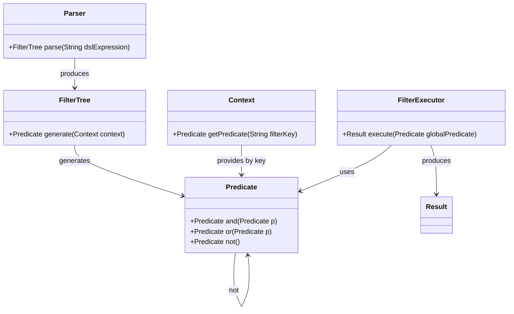

# Dynamic Filtering System Architecture

---

## Description of the Filtering Query Execution Process

1. **Parsing and validating the DSL**  
   The parser checks the DSL’s syntax and ensures all referenced filter keys exist in the filter object.  
   The outcome is a combined filter tree (`FilterTree`).  
   > *An error is returned if the DSL is invalid.*

2. **Constructing and validating filters**  
   Each filter condition is validated to confirm the referenced property supports the specified operator for the given type/value.  
   The corresponding predicate is built, but filtering is not yet performed.  
   > *An error is returned if a predicate cannot be built.*

3. **Generating the global predicate**  
   From the combination tree, generate the global predicate that will be used to filter data.

4. **Executing and returning results**  
   The global predicate applies to the dataset to filter results, which are then returned.

---

## Main Interfaces

| Interface / Contract | Required Methods       | Parameters             | Return Type        | Description                                                                                |
|----------------------|-------------------------|-----------------------|--------------------|--------------------------------------------------------------------------------------------|
| **Parser**           | parse                   | DSL expression (text) | `FilterTree`       | Parses the DSL expression and builds the logical combined filter tree.                     |
| **FilterTree**       | generate                | `Context`             | `Predicate`        | Produces the global predicate for filtering based on the filter combination tree.          |
| **Context**          | getPredicate            | Filter key (text)   | `Predicate`        | Retrieves the predicate associated with the filter key within the execution context.       |
| **Predicate**        | and                     | `Predicate`           | `Predicate`        | Returns a new predicate representing the logical AND of the current and given predicate.   |
|                      | or                      | `Predicate`           | `Predicate`        | Returns a new predicate representing the logical OR of the current and given predicate.    |
|                      | not                     | *None*                | `Predicate`        | Returns a new predicate representing the logical negation of the current predicate.        |
| **FilterExecutor**   | execute                 | `Predicate`             | *Filtered results* | Executes the filtering operation based on the global predicate and returns filtered results.  |

---

## Additional Explanations

- **Parser**: Translates the DSL into an exploitable logical tree structure.  
- **FilterTree**: Represents the logical structure combining filters to generate a global predicate.  
- **Context**: Holds the set of valid filters and enables mapping of filter keys to concrete predicates.  
- **Predicate**: Abstract entity representing a condition or logical combination of conditions on the data.  
- **FilterExecutor**: Applies the global predicate to the data source and produces filtered results.

---

## UML Class Diagram

### Explanation
- **Parser** produces a FilterTree from a DSL expression string.

- **FilterTree** generates a global Predicate from the combination tree.

- **Context** manages filter predicates keyed by unique filter tokens.

- **Predicate** supports logical combinators: and, or, not, returning new predicates.

- **FilterExecutor** uses the global predicate to execute the filtering and return results.

This diagram represents the main components and their method interactions at a high level in the dynamic filtering system, independently from any specific programming language.
