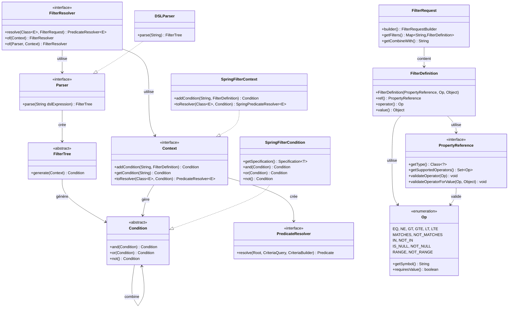

# Architecture FilterQL

> **Architecture en couches avec séparation claire des responsabilités pour un filtrage dynamique sécurisé et extensible**

---

## Vue d'Ensemble

FilterQL implémente une **architecture à quatre couches** qui sépare les préoccupations à travers quatre couches distinctes, permettant un filtrage dynamique type-safe avec une validation complète. Le système transforme des expressions DSL de haut niveau en constructions de requête spécifiques au framework tout en maintenant une sécurité des types stricte et une validation des opérateurs.

### Proposition de Valeur

- **Sécurité des Types** : Validation des propriétés et opérateurs à la compilation
- **Agnosticisme Framework** : Adaptable à toute technologie de persistance  
- **Expressivité DSL** : Logique booléenne avec précédence et groupement
- **Validation Complète** : Validation multi-niveaux avec exceptions spécifiques
- **Prêt pour Production** : Cache, évaluation paresseuse, et optimisations de performance

---

## Architecture en Couches

```
┌─────────────────────────────────────────┐
│              Couche DSL                 │
│  (Parser, FilterTree, Logique Booléenne)│
├─────────────────────────────────────────┤
│           Couche Validation             │
│   (PropertyReference, Operators, Op)    │
├─────────────────────────────────────────┤
│             Couche Modèle               │
│  (FilterDefinition, FilterRequest)      │
├─────────────────────────────────────────┤
│          Couche Exécution               │
│  (Context, Condition, PredicateResolver)│
└─────────────────────────────────────────┘
```

### Responsabilités des Couches

#### 1. Couche DSL
- **Parser** : Transforme le DSL textuel en logique booléenne exécutable
- **FilterTree** : Représente la structure logique avec gestion de précédence
- **Logique Booléenne** : Support de `&` (AND), `|` (OR), `!` (NOT) avec précédence appropriée

#### 2. Couche Validation  
- **PropertyReference** : Interface enum type-safe pour définitions de propriétés
- **Opérateurs (Op)** : Ensemble d'opérateurs complet avec validation intégrée
- **Vérification de Types** : Assure que les types de valeurs correspondent aux attentes des propriétés

#### 3. Couche Modèle
- **FilterDefinition** : Conteneur type-safe pour logique de filtre
- **FilterRequest** : Builder de requête immuable avec validation
- **Pattern Builder** : API fluide pour construction de filtres complexes

#### 4. Couche Exécution
- **Context** : Gère les conditions de filtre et le cycle de vie
- **Condition** : Condition de filtre abstraite avec combinateurs logiques
- **PredicateResolver** : Convertit les conditions en requêtes spécifiques au framework

---

## Processus de Filtrage Détaillé

### 1. **Parsing DSL et Validation**

**Fichier source** : `core/java/src/main/java/io/github/cyfko/filterql/core/impl/DSLParser.java`

```java
Parser parser = new DSLParser();
FilterTree tree = parser.parse("(activeUsers & premiumTier) | !suspended");
```

- Valide la syntaxe DSL avec rapport d'erreur approprié
- Construit un arbre logique avec précédence des opérateurs
- Assure que les clés de filtre référencées existent dans la requête de filtre
- **Erreur** : `DSLSyntaxException` pour syntaxe invalide

### 2. **Construction de Filtres Type-Safe**

**Fichier source** : `core/java/src/main/java/io/github/cyfko/filterql/core/model/FilterDefinition.java`

```java
FilterDefinition<UserPropertyRef> activeFilter = 
    new FilterDefinition<>(UserPropertyRef.STATUS, Op.EQ, UserStatus.ACTIVE);
```

- Valide la compatibilité propriété-opérateur à la compilation
- Assure que les types de valeurs correspondent aux déclarations de propriétés
- Valide les contraintes spécifiques aux opérateurs (ex. RANGE nécessite exactement 2 valeurs)
- **Erreur** : `FilterValidationException` pour échecs de validation

### 3. **Population du Contexte et Construction des Conditions**

**Fichier source** : `core/java/src/main/java/io/github/cyfko/filterql/core/Context.java`

```java
Context context = new ContextImpl();
context.addCondition("activeUsers", activeFilter);
Condition globalCondition = tree.generate(context);
```

- Stocke les conditions de filtre validées avec des clés string
- Construit un arbre de conditions reflétant la structure logique DSL
- Maintient l'intégrité référentielle entre DSL et filtres
- **Erreur** : Exception runtime pour clés de filtre manquantes

### 4. **Exécution Native Framework**

**Fichier source** : `adapters/java/spring/src/main/java/io/github/cyfko/filterql/adapter/spring/FilterContext.java`

```java
PredicateResolver<User> resolver = context.toResolver(User.class, globalCondition);
// JPA: javax.persistence.criteria.Predicate
// Spring Data: org.springframework.data.jpa.domain.Specification<T>
```

- Convertit les conditions abstraites en constructions spécifiques au framework
- Exploite la pagination, le tri, la mise en cache natifs du framework
- Maintient la gestion des transactions et le pool de connexions
- **Performance** : Transformation sans copie avec évaluation paresseuse

---

## Composants Principaux & Interfaces

### Composants Primaires

| Composant | Responsabilité | Méthodes Clés | Description |
|-----------|---------------|-------------|-------------|
| **FilterResolver** | Orchestration de pipeline | `resolve(Class<E>, FilterRequest)` | Point d'entrée principal - orchestre parsing, validation, et résolution de prédicat |
| **Parser** | Traitement DSL | `parse(String dslExpression)` | Transforme les expressions DSL en structures FilterTree exécutables |
| **FilterTree** | Structure logique | `generate(Context)` | Représente l'arbre de logique booléenne et génère les conditions globales |
| **PropertyReference** | Sécurité des types | `validateOperator(Op)`, `validateOperatorForValue(Op, Object)` | Interface enum assurant la sécurité des types à la compilation et validation des opérateurs |
| **Context** | Gestion des conditions | `addCondition(String, FilterDefinition)`, `getCondition(String)` | Gère le cycle de vie des filtres et stockage des conditions |
| **Condition** | Opérations logiques | `and(Condition)`, `or(Condition)`, `not()` | Condition de filtre abstraite avec combinateurs booléens |
| **PredicateResolver** | Pont vers framework | Implémentation spécifique au framework | Convertit les conditions en constructions de requête natives |

### Contrats d'Interface Améliorés

#### FilterResolver
**Fichier source** : `core/java/src/main/java/io/github/cyfko/filterql/core/FilterResolver.java`

```java
public interface FilterResolver {
    <E> PredicateResolver<E> resolve(Class<E> entityClass, FilterRequest<? extends PropertyReference> request);
    static FilterResolver of(Context context);
    static FilterResolver of(Parser parser, Context context);
}
```

#### PropertyReference (Amélioré)
**Fichier source** : `core/java/src/main/java/io/github/cyfko/filterql/core/validation/PropertyReference.java`

```java
public interface PropertyReference {
    Class<?> getType();
    Set<Op> getSupportedOperators();
    void validateOperator(Op operator) throws FilterValidationException;
    void validateOperatorForValue(Op operator, Object value) throws FilterValidationException;
    String getPropertyName(); // Dérivé du nom enum par défaut
}
```

#### Support d'Opérateurs Étendu
**Fichier source** : `core/java/src/main/java/io/github/cyfko/filterql/core/validation/Op.java`

```java
public enum Op {
    // Opérateurs de comparaison
    EQ("="), NE("!="), GT(">"), GTE(">="), LT("<"), LTE("<="),
    
    // Correspondance de patterns
    MATCHES("LIKE"), NOT_MATCHES("NOT LIKE"),
    
    // Opérations sur ensembles  
    IN("IN"), NOT_IN("NOT IN"),
    
    // Vérifications de null
    IS_NULL("IS NULL"), NOT_NULL("IS NOT NULL"),
    
    // Opérations de plage
    RANGE("BETWEEN"), NOT_RANGE("NOT BETWEEN");
}
```

### Adaptateurs Framework

#### Adaptateur Spring Data JPA
**Fichier source** : `adapters/java/spring/src/main/java/io/github/cyfko/filterql/adapter/spring/FilterContext.java`

```java
// Convertit Condition en Specification<T>
PredicateResolver<User> resolver = springContext.toResolver(User.class, condition);
Specification<User> spec = resolver.toSpecification();
```

**Points d'Intégration** :
- `Specification<T>` pour construction de requête type-safe
- `CriteriaBuilder` pour construction de requête dynamique  
- `Root<T>` pour résolution de chemin de propriété
- Pagination et tri Spring Data natifs

---

## Patterns de Conception & Principes Architecturaux

### 1. Pattern Builder
**Usage** : Construction d'objets complexes avec validation

**Fichier source** : `core/java/src/main/java/io/github/cyfko/filterql/core/model/FilterRequest.java`

```java
FilterRequest<UserPropertyRef> request = FilterRequest.<UserPropertyRef>builder()
    .filter("activeUsers", activeDefinition)
    .filter("premiumTier", premiumDefinition)
    .combineWith("activeUsers & premiumTier")
    .build();
```

### 2. Pattern Strategy  
**Usage** : PropertyReference permet différentes stratégies de validation par type de propriété

```java
// Les propriétés textuelles supportent la correspondance de patterns
NAME(String.class, Set.of(Op.EQ, Op.MATCHES, Op.IN))

// Les propriétés numériques supportent les opérations de plage  
AGE(Integer.class, Set.of(Op.EQ, Op.GT, Op.GTE, Op.LT, Op.LTE, Op.RANGE))
```

### 3. Pattern Composite
**Usage** : Les conditions peuvent être combinées récursivement utilisant la logique booléenne

```java
Condition nameCondition = context.getCondition("nameFilter");
Condition ageCondition = context.getCondition("ageFilter");
Condition combined = nameCondition.and(ageCondition).or(vipCondition);
```

### 4. Pattern Template Method
**Usage** : FilterResolver orchestre un pipeline cohérent

1. Parser l'expression DSL → FilterTree
2. Peupler le contexte avec FilterDefinitions  
3. Générer la Condition globale à partir de l'arbre
4. Convertir en PredicateResolver spécifique au framework

### 5. Pattern Adapter
**Usage** : Génération de requête spécifique au framework

**Fichier source** : `adapters/java/spring/src/main/java/io/github/cyfko/filterql/adapter/spring/FilterCondition.java`

```java
// Même Condition, différentes sorties framework
Condition condition = //...

// Spring Data JPA
Specification<User> jpaSpec = springAdapter.toSpecification(condition);

// Futur: Prisma  
PrismaWhereClause prismaWhere = prismaAdapter.toWhereClause(condition);
```

### 6. Principes de Sécurité des Types
- **Validation à la compilation** : L'enum PropertyReference contraint les opérations disponibles
- **Validation runtime** : Validation multi-niveaux avec exceptions spécifiques
- **Fail-fast** : Configurations invalides détectées au moment de la construction
- **Objets immuables** : Comportement thread-safe et prévisible

---

## Considérations de Performance & Évolutivité

### Stratégie de Cache

**Fichier source** : `core/java/src/main/java/io/github/cyfko/filterql/core/utils/ClassUtils.java`

```java
// Résultats de réflexion de champs mis en cache dans ClassUtils
private static final Map<String, Field> FIELD_CACHE = new ConcurrentHashMap<>();

// Hiérarchie de superclasse mise en cache pour performance
private static final Map<Class<?>, List<Class<?>>> HIERARCHY_CACHE = new ConcurrentHashMap<>();
```

### Efficacité Mémoire
- **Objets immuables** : Réduisent l'allocation mémoire et la pression GC
- **Pattern Flyweight** : Instances d'opérateurs partagées et résultats de validation
- **Évaluation paresseuse** : Conditions construites seulement quand nécessaire
- **Sans copie** : Transformation directe sans représentations intermédiaires

### Fonctionnalités d'Évolutivité
- **Thread-safe** : Tous les composants principaux sont sans état ou immuables
- **Pool de connexions** : Exploite la gestion native des connexions du framework
- **Optimisation de requête** : Délègue aux optimiseurs de requête prouvés du framework
- **Cache** : Cache de résultats de requête natif du framework (cache JPA L1/L2)

---

## Système de Validation & Gestion d'Erreurs

### Validation Multi-Niveaux

#### 1. Compile-Time (PropertyReference)
```java
public enum UserPropertyRef implements PropertyReference {
    // Type et opérateurs définis à la compilation
    AGE(Integer.class, Set.of(Op.EQ, Op.GT, Op.GTE, Op.LT, Op.LTE, Op.RANGE));
}
```

#### 2. Construction-Time (FilterDefinition)
```java
// Valide la compatibilité opérateur avec propriété
new FilterDefinition<>(UserPropertyRef.AGE, Op.MATCHES, 25); // Lance FilterValidationException
```

#### 3. Value-Time (Validation d'opérateur)
```java
// Valide le type de valeur et contraintes spécifiques à l'opérateur
UserPropertyRef.AGE.validateOperatorForValue(Op.RANGE, List.of(18, 65)); // OK
UserPropertyRef.AGE.validateOperatorForValue(Op.RANGE, List.of(18)); // Exception: nécessite exactement 2 valeurs
```

#### 4. Parse-Time (Validation DSL)
```java
// Valide la syntaxe et références de clés de filtre
parser.parse("invalid & & expression"); // Lance DSLSyntaxException
parser.parse("nonExistentFilter"); // Lance exception si filtre pas dans requête
```

### Hiérarchie d'Exceptions

#### Implémentation Actuelle
**Fichier source** : `core/java/src/main/java/io/github/cyfko/filterql/core/exception/`

```java
FilterQLException (Runtime)
├── DSLSyntaxException          // Erreurs de parsing DSL - ✅ Implémenté
└── FilterValidationException   // Erreurs de validation propriété/opérateur - ✅ Implémenté
```

---

## Points d'Extension & Personnalisation

### 1. Implémentation PropertyReference Personnalisée

```java
public enum CustomPropertyRef implements PropertyReference {
    EMAIL(String.class, Set.of(Op.EQ, Op.MATCHES)) {
        @Override
        public void validateOperatorForValue(Op operator, Object value) {
            super.validateOperatorForValue(operator, value);
            // Ajouter validation email personnalisée
            if (value instanceof String email && !email.contains("@")) {
                throw new FilterValidationException("Format email invalide");
            }
        }
    };
}
```

### 2. Parser DSL Personnalisé

```java
public class CustomDSLParser implements Parser {
    @Override
    public FilterTree parse(String dslExpression) {
        // Logique de parsing personnalisée - peut supporter des opérateurs supplémentaires
        // ou syntaxe différente (SQL-like, notation mathématique, etc.)
    }
}

FilterResolver resolver = FilterResolver.of(new CustomDSLParser(), context);
```

### 3. Développement d'Adaptateur Framework

**Fichier source** : `adapters/java/spring/src/main/java/io/github/cyfko/filterql/adapter/spring/`

```java
public class MyFrameworkAdapter implements PredicateResolver<Entity> {
    @Override
    public MyFrameworkQuery toNativeQuery() {
        // Convertir Condition en constructions de requête spécifiques au framework
    }
}
```

---

## Diagramme de Classes UML



---

## Meilleures Pratiques & Recommandations

### Conception PropertyReference

```java
public enum UserPropertyRef implements PropertyReference {
    // Utiliser des noms descriptifs et significatifs métier
    USER_FULL_NAME(String.class, OperatorUtils.FOR_TEXT),
    
    // Grouper opérateurs liés utilisant des ensembles utilitaires
    USER_AGE(Integer.class, OperatorUtils.FOR_NUMBER),
    USER_REGISTRATION_DATE(LocalDate.class, OperatorUtils.FOR_DATE),
    
    // Être explicite sur les opérations supportées
    USER_STATUS(UserStatus.class, Set.of(Op.EQ, Op.NE, Op.IN, Op.NOT_IN));
    
    // Validation personnalisée pour règles métier
    USER_EMAIL(String.class, Set.of(Op.EQ, Op.MATCHES)) {
        @Override
        public void validateOperatorForValue(Op operator, Object value) {
            super.validateOperatorForValue(operator, value);
            if (value instanceof String email && !email.contains("@")) {
                throw new FilterValidationException("Format email invalide");
            }
        }
    };
}
```

### Stratégie de Gestion d'Erreurs

```java
@RestController
public class UserController {
    
    public ResponseEntity<List<User>> findUsers(FilterRequest<UserPropertyRef> request) {
        try {
            FilterResolver resolver = FilterResolver.of(springContext);
            PredicateResolver<User> predicate = resolver.resolve(User.class, request);
            
            Specification<User> spec = predicate.toSpecification();
            List<User> users = userRepository.findAll(spec);
            
            return ResponseEntity.ok(users);
            
        } catch (DSLSyntaxException e) {
            log.warn("Syntaxe DSL invalide: {}", e.getMessage());
            return ResponseEntity.badRequest()
                .header("X-Error-Type", "DSL_SYNTAX")
                .body(null);
                
        } catch (FilterValidationException e) {
            log.warn("Échec validation filtre: {}", e.getMessage());
            return ResponseEntity.badRequest()
                .header("X-Error-Type", "FILTER_VALIDATION")
                .body(null);
                
        } catch (Exception e) {
            log.error("Erreur inattendue lors du filtrage", e);
            return ResponseEntity.internalServerError().body(null);
        }
    }
}
```

---

## Roadmap & Extensions Futures

### Fonctionnalités Planifiées (v2.1+)
- **Opérateurs Personnalisés** : Support pour opérateurs spécifiques au domaine (REGEX, GEOSPATIAL, FULL_TEXT)
- **Optimisation de Requête** : Optimisation automatique de plan de requête basée sur patterns d'usage
- **Support Réactif** : Intégration avec Spring WebFlux et streams réactifs
- **Intégration GraphQL** : Support natif des arguments de filtre GraphQL

### Expansion Framework
- **Adaptateur MongoDB** : Support de requête MongoDB native
- **Adaptateur Elasticsearch** : Intégration recherche full-text
- **Adaptateur MyBatis** : Génération SQL dynamique
- **Adaptateur R2DBC** : Accès base de données réactif

### Fonctionnalités Avancées
- **Présets de Filtres** : Configurations de filtres réutilisables et nommées
- **Schémas Dynamiques** : Découverte et validation de propriétés runtime
- **Support Multi-Tenant** : Filtrage tenant-aware avec isolation
- **Analytics de Filtres** : Patterns d'usage et analytics de performance

---

## Références & Documentation

### Documentation Principale
- **[Guide Démarrage](../getting-started.md)** - Configuration rapide et premiers pas
- **[Vue d'Ensemble Module Core](../implementations/core/)** - Documentation détaillée des composants
- **[Guide Adaptateur Spring](../implementations/spring-adapter/)** - Patterns d'intégration Spring
- **[Référence API](../api-reference.md)** - Référence Javadoc complète

### Exemples & Guides
- **[Exemples Usage de Base](../examples/basic-usage.md)** - Patterns de filtrage courants
- **[Patterns Avancés](../examples/advanced-patterns.md)** - Scénarios complexes et cas limites
- **[Optimisation Performance](../guides/performance.md)** - Stratégies d'optimisation
- **[Guide Migration](../guides/migration.md)** - Mise à niveau entre versions

---

*Documentation basée sur l'analyse du fichier ARCHITECTURE.md et des sources du projet FilterQL.*