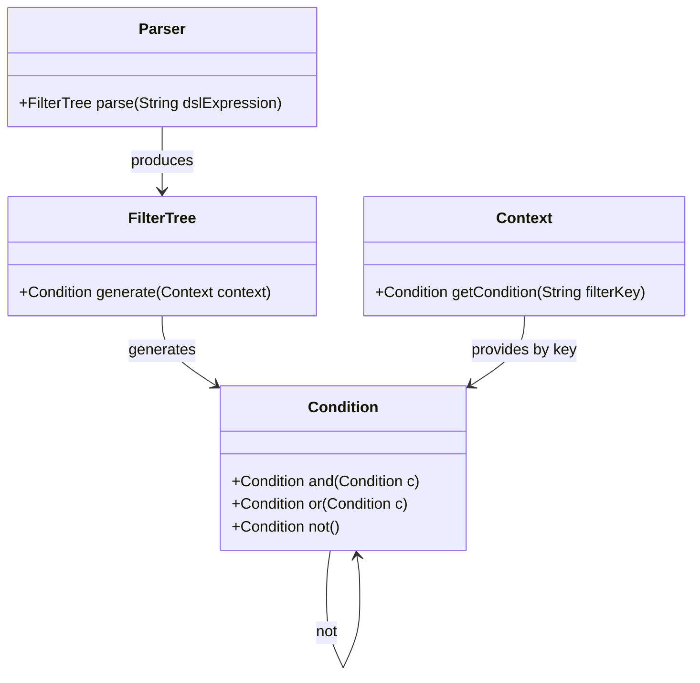

# Dynamic Filtering System Architecture

---

## Description of the Filtering Query Execution Process

1. **Parsing and validating the DSL**  
   The parser checks the DSL's syntax and ensures all referenced filter keys exist in the filter object.  
   The outcome is a combined filter tree (`FilterTree`).  
   > *An error is returned if the DSL is invalid.*

2. **Constructing and validating filter conditions**  
   Each filter definition is validated to confirm the referenced property supports the specified operator for the given type/value.  
   The corresponding condition is built and stored in the context, but filtering is not yet performed.  
   > *An error is returned if a condition cannot be built.*

3. **Generating the global condition**  
   From the combination tree, generate the global condition that will be used to filter data.

4. **Framework-native execution**  
   The global condition is converted to framework-specific query constructs (JPA Criteria, Prisma where clause, Django Q objects, etc.) and executed using the framework's proven mechanisms for pagination, sorting, caching, and transaction management.

---

## Main Interfaces

| Interface / Contract | Required Methods       | Parameters             | Return Type        | Description                                                                                |
|----------------------|-------------------------|-----------------------|--------------------|--------------------------------------------------------------------------------------------|
| **Parser**           | parse                   | DSL expression (text) | `FilterTree`       | Parses the DSL expression and builds the logical combined filter tree.                     |
| **FilterTree**       | generate                | `Context`             | `Condition`        | Produces the global condition for filtering based on the filter combination tree.          |
| **Context**          | getCondition            | Filter key (text)     | `Condition`        | Retrieves the condition associated with the filter key within the execution context.       |
| **Condition**        | and                     | `Condition`           | `Condition`        | Returns a new condition representing the logical AND of the current and given condition.   |
|                      | or                      | `Condition`           | `Condition`        | Returns a new condition representing the logical OR of the current and given condition.    |
|                      | not                     | *None*                | `Condition`        | Returns a new condition representing the logical negation of the current condition.        |

---

## Additional Explanations

- **Parser**: Translates the DSL into an exploitable logical tree structure.  
- **FilterTree**: Represents the logical structure combining filters to generate a global condition.  
- **Context**: Holds the set of valid filter conditions and enables mapping of filter keys to concrete conditions.  
- **Condition**: Abstract entity representing a filter condition or logical combination of conditions on the data.  

**Note**: The library focuses on **condition generation only**. Query execution, pagination, sorting, caching, and transaction management are handled by each framework's native mechanisms (JPA Criteria API, Prisma Client, Django ORM, etc.).

---

## UML Class Diagram

### Explanation
- **Parser** produces a FilterTree from a DSL expression string.
- **FilterTree** generates a global Condition from the combination tree.
- **Context** manages filter conditions keyed by unique filter tokens.
- **Condition** supports logical combinators: and, or, not, returning new conditions.

The generated **Condition** is then converted by each framework adapter to native query constructs:
- **JPA**: `javax.persistence.criteria.Predicate`
- **Prisma**: JSON where clause object
- **Django**: `Q` objects
- **Entity Framework**: LINQ expressions

This diagram represents the main components and their method interactions at a high level in the dynamic filtering system, independently from any specific programming language or framework execution mechanism.